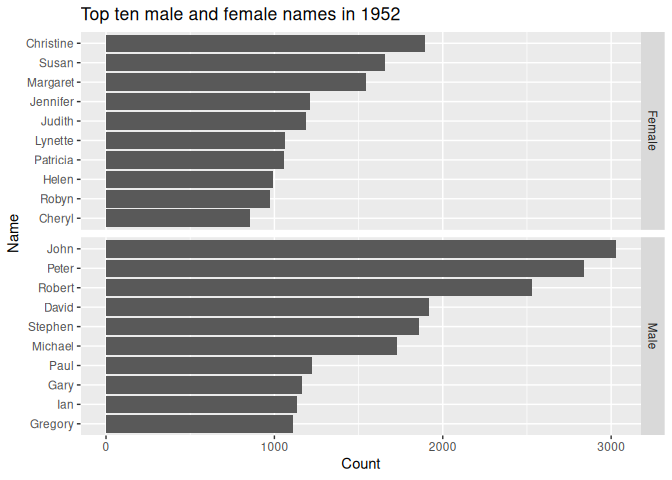

<!-- README.md is generated from README.Rmd. Please edit that file -->

# ozbabynames

The ozbabynames package provides the dataset `ozbabynames`. This
contains popular Australian baby names by sex, state and year.

``` r
library(ozbabynames)
head(ozbabynames)
#>        name    sex year count           state
#> 1 Charlotte Female 2017   577 New South Wales
#> 2    Olivia Female 2017   550 New South Wales
#> 3       Ava Female 2017   464 New South Wales
#> 4    Amelia Female 2017   442 New South Wales
#> 5       Mia Female 2017   418 New South Wales
#> 6      Isla Female 2017   392 New South Wales
```

## Installation

You can install the released version of ozbabynames from github:

``` r
install_github("ropenscilabs/ozbabynames")
```

## Example usage

``` r
library(ggplot2)
library(dplyr)
#> 
#> Attaching package: 'dplyr'
#> The following objects are masked from 'package:stats':
#> 
#>     filter, lag
#> The following objects are masked from 'package:base':
#> 
#>     intersect, setdiff, setequal, union

ozbabynames_2016_top_10 <- ozbabynames %>%
  filter(year == 2016) %>%
  group_by(sex, name) %>%
  summarise(count = sum(count)) %>%
  arrange(-count) %>%
  top_n(10) %>%
  ungroup()
#> Selecting by count

ggplot(ozbabynames_2016_top_10,
       aes(x = reorder(name, count),
           y = count,
           group = sex)) +
  geom_col() +
  facet_grid(sex ~ ., 
             scales = "free_y") +
  coord_flip() +
  ylab("Count") + xlab("Name") +
  ggtitle("Top ten male and female names in 2016")
```



## Known Issues

The coverage is very uneven, with some states only providing very recent
data, and some states only providing the top 50 or 100 names. The ACT do
not provide counts, and so no ACT data are included. South Australia has
by far the best data, with full coverage of all names back to 1944.
