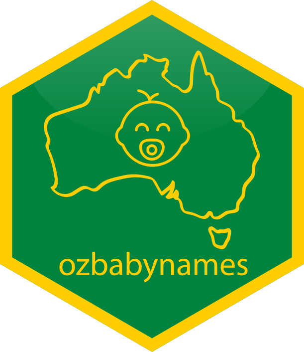
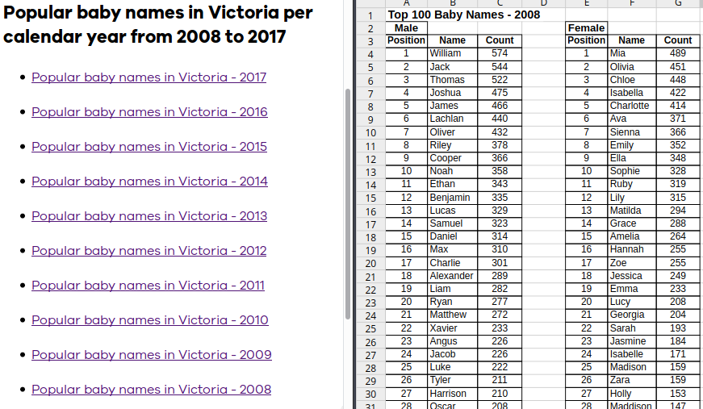
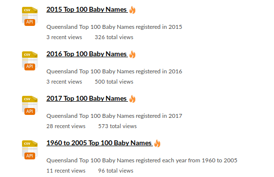
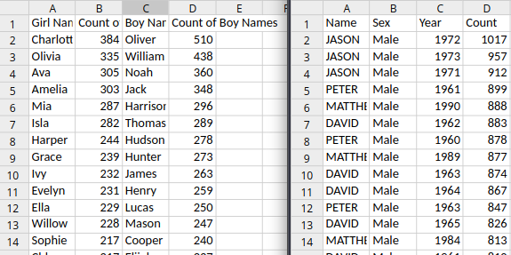
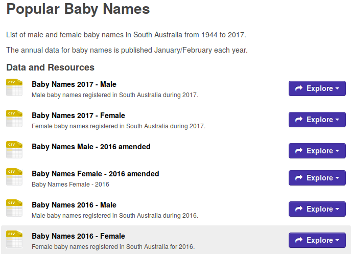
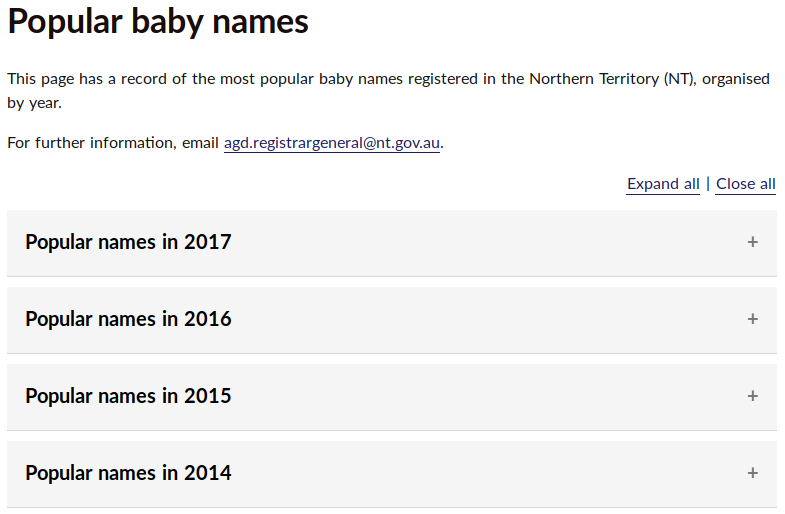
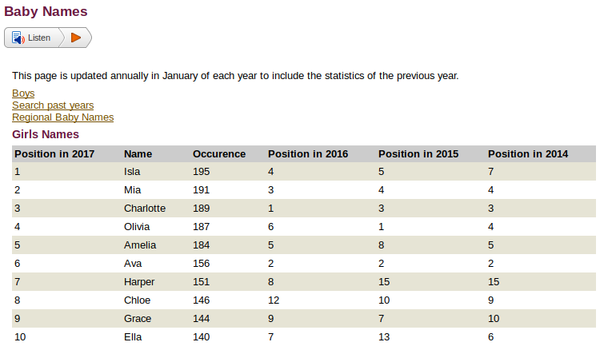
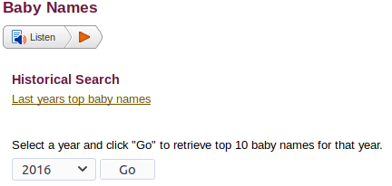
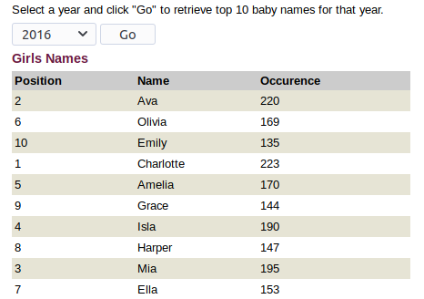
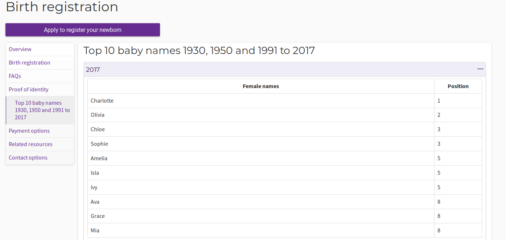

class: inverse

```{r setup, include=FALSE}
library(fontawesome)
library(tidyverse)
options(htmltools.dir.version = FALSE, width = 120)
```

.title[ozbabynames]
.sticker-float[]

## Tidying Australian baby names

.bottom[
- Mitchell O'Hara-Wild (`r fa("twitter", fill="#1da1f2")`[@mitchoharawild](https://twitter.com/mitchoharawild))
- Rob Hyndman (`r fa("twitter", fill="#1da1f2")`[@robjhyndman](https://twitter.com/robjhyndman/))
- Jessie Roberts (`r fa("twitter", fill="#1da1f2")`[@_jessie_roberts](https://twitter.com/_jessie_roberts))
- Nick Tierney (`r fa("twitter", fill="#1da1f2")`[@nj_tierney](https://twitter.com/nj_tierney/))

23 November 2018
]

---
class: inverse, center, middle

.title[the data]

---

# the data

```{r data}
mtcars
```


---
class: inverse, center, middle

.title[the journey]

(a small audit of Australia's baby name data)

---

# VIC

[](https://www.bdm.vic.gov.au/births/naming-your-child/popular-baby-names-in-victoria)

---

# VIC

.pull-left[
# The good
- Consistent data structure
]

--

.pull-right[
# The bad
- Poor data structure
]

---

# QLD

[](https://data.qld.gov.au/dataset/top-100-baby-names)

---

# QLD



---

# QLD

.pull-left[
# The good
- Tidy data structures
]

--

.pull-right[
# The worse
- Inconsistent data structures
]

---

# TAS

[](https://data.gov.au/dataset/0ec6f374-8b54-4500-ae40-97f39bba9036)

---

# TAS

.pull-left[
# The good
- (Mostly) tidy data structures
]

--

.pull-right[
# The awful
- Inconsistent data structures
- Some missing column names
]


---

# SA

[](https://data.sa.gov.au/data/dataset/popular-baby-names)

---

# SA

.pull-left[
# The good
- (Mostly) tidy data structures
]

--

.pull-right[
# The horrific
- Inconsistent file names
- "BABY" name, causing invalid CSV
]

--

<br>
 

```{r sa-file-path, echo=FALSE}
rev(head(fs::dir_ls("../data-raw/sa/")))
```

--

sa/female_cy1953_top.csv, line 450
> ""BABY"","1","=449"

---

# NT

[](https://nt.gov.au/law/bdm/popular-baby-names)

---

# NT

.pull-left[
# The good
- Consistent structure
- Single webpage
]

--

.pull-right[
# The horrible
- No downloadable data
- Dirty data
- Missing years
]


---

# WA

[](https://bdm.justice.wa.gov.au/_apps/BabyNames/Default.aspx)
---

# WA

[](https://bdm.justice.wa.gov.au/_apps/BabyNames/Default.aspx)
---

# WA

[](https://bdm.justice.wa.gov.au/_apps/BabyNames/Default.aspx)

---

# WA

.pull-left[
# The good
- The data exists
]

--

.pull-right[
# The dreadful
- No downloadable data
- Javascript data app abomination
]


---

# ACT

[](https://www.accesscanberra.act.gov.au/app/answers/detail/a_id/1693/#!tabs-5a)

---

# ACT

.pull-left[
# The good
- ... consistent?
]

--

.pull-right[
# The abomination
- No downloadable data
- No count data
- Missing years
]
