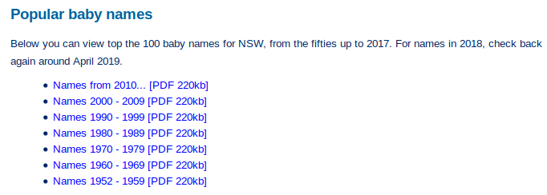

class: inverse

```{r setup, include=FALSE}
library(fontawesome)
library(tidyverse)
options(htmltools.dir.version = FALSE, width = 120)
library(ozbabynames)
```

.title[ozbabynames]
.sticker-float[]

## Tidying Australian baby names

.bottom[
- Mitchell O'Hara-Wild (`r fa("twitter", fill="#1da1f2")`[@mitchoharawild](https://twitter.com/mitchoharawild))
- Rob Hyndman (`r fa("twitter", fill="#1da1f2")`[@robjhyndman](https://twitter.com/robjhyndman/))
- Jessie Roberts (`r fa("twitter", fill="#1da1f2")`[@_jessie_roberts](https://twitter.com/_jessie_roberts))
- Nick Tierney (`r fa("twitter", fill="#1da1f2")`[@nj_tierney](https://twitter.com/nj_tierney/))

23 November 2018
]


---
class: inverse, center, middle

.title[the why]

---
# the why

- the US [babynames packages](https://github.com/hadley/babynames) created by Hadley has an average of 98 downloads a day, and 15 downloads in Australia every 10 days. 
- Great dataset for demonstration and teaching: 
    - everyone has a name
    - non-political 
    - contains geospatial information (state) 
    - contains time data (years) 
    - the data is well recorded and maintained
    - fun
  
  
.center["Wouldn't it be great if we had an Australian version."]
    

---
class: inverse, center, middle

.centre["ozbabynames will be an easy first project for the Runconf2018."]

.centre["We can contribute to the availability of Australian data."] 

.centre["we'll have it finished by lunchtime"]


---
class: inverse, center, middle

.title[lets get started]

---
# step 1: Australian open data portal


1. Australian Gov [Open Data Portal](https://search.data.gov.au/). 

[.smaller_image[.centre[]]](https://search.data.gov.au/)

---

class: inverse, center, middle

.centre["Surely the data will already be there. We'll just clean it up and put it into a package."]    

.title[hmmm nope!!]


---
# step 1: Australian open data portal

> 1. no nationa data set
> 2. some missing
> 3. different formats
> 4. different years
> 5. some with counts some with proportions
> 6. inconsistena and poor labelling of files

---
# step 2: state by state

.centre["The Births, Deaths & Marriages Registries will have this available. After all, that's their primary job, and Australia signed the Open Data Charter in 2017"] 

Australian Open Data Charter states that government data should be: 
>  1. Open by defailt
>  2. Timely and comprehensive
>  3. Accessible and usable
>  4. Comparable and interoperable
>  5. For improved governance and citizen engagement 
>  6. For inclusive development and innovation

---

class: inverse, center, middle

.title[the data]

---

# the data

```{r data, echo=FALSE}
#head(ozbabynames)
```


| State | date range  | available data  |variables|
| ----- |:--------:| :-----------------|:----|
|QLD|2006 - 2017 |counts for top 10 names |name, sex, year, count, state |
|NSW|1952 - 2017 |counts for top 10 names |" "|
|ACT|- | ranked top 10 names each year|" "|
|VIC|2008 - 2017|counts for top 10 names|" "|
|SA|1944 - 2017|counts of all names|" "|
|WA|1930 - 2016|counts for top 10 names|" "|
|TAS|2010 - 2016|counts for top 10 names|" "|


---
class: inverse, center, middle

.title[the journey]

(a small audit of Australia's baby name data)

---

# VIC

[](https://www.bdm.vic.gov.au/births/naming-your-child/popular-baby-names-in-victoria)

---

# VIC

.pull-left[
# The good
- Consistent data structure
]

--

.pull-right[
# The bad
- Poor data structure
]

---

# QLD

[](https://data.qld.gov.au/dataset/top-100-baby-names)

---

# QLD


---

# QLD

.pull-left[
# The good
- (Mostly) tidy data structures
]

--

.pull-right[
# The worse
- Inconsistent data structures
]

---

# TAS

[](https://data.gov.au/dataset/0ec6f374-8b54-4500-ae40-97f39bba9036)

---

# TAS

.pull-left[
# The good
- (Mostly) tidy data structures
]

--

.pull-right[
# The awful
- Inconsistent data structures
- Some missing column names
]


---

# SA

[](https://data.sa.gov.au/data/dataset/popular-baby-names)

---

# SA

.pull-left[
# The good
- (Mostly) tidy data structures
]

--

.pull-right[
# The horrible
- Inconsistent file names
- "BABY" name, breaking the CSV!
]

--

<br>
 

```{r sa-file-path, echo=FALSE}
rev(head(fs::dir_ls("../data-raw/sa/")))
```

--

sa/female_cy1953_top.csv, line 450
> ""BABY"","1","=449"

---

# NSW

[](https://www.bdm.nsw.gov.au/Pages/about-us/facts-statistics.aspx#Popularbabynames)

---

# NSW

.pull-left[
# The good
- Consistent data structure
]

--

.pull-right[
# It's not like you threw up in the washing machine?
- PDF tables!
- Untidy data structures
]

---

# NT

[](https://nt.gov.au/law/bdm/popular-baby-names)

---

# NT

.pull-left[
# The good
- Consistent structure
- Single webpage
]

--

.pull-right[
# The horrific
- No downloadable data
- Dirty data
- Missing years
]


---

# WA

[](https://bdm.justice.wa.gov.au/_apps/BabyNames/Default.aspx)
---

# WA

[](https://bdm.justice.wa.gov.au/_apps/BabyNames/Default.aspx)
---

# WA

[](https://bdm.justice.wa.gov.au/_apps/BabyNames/Default.aspx)

---

# WA

.pull-left[
# The good
- The data exists
]

--

.pull-right[
# The dreadful
- No downloadable data
- Javascript data app abomination
]


---

# ACT

[](https://www.accesscanberra.act.gov.au/app/answers/detail/a_id/1693/#!tabs-5a)

---

# ACT

.pull-left[
# The good
- ... consistent?
]

--

.pull-right[
# The abomination
- No downloadable data
- No count data
- Missing years
]

---
# Summary

1. we finished it - but not before lunchtime.
2. Australia's Open Data portal is not so 'open'. 
3. next step: write a post-mortem of our journey through Australian open data as a blog post, report or article.
4. audit the QLD Open Data Portal for adherence to the Australian Open Data Charter.
---

```{r diversity, echo=FALSE, message=FALSE}

all <- ozbabynames |> 
  filter(count >=300)

diversity <- ggplot(all, aes(year, count)) + geom_point() + ggtitle("Counts of most popular names over time") 

diversity 

```


